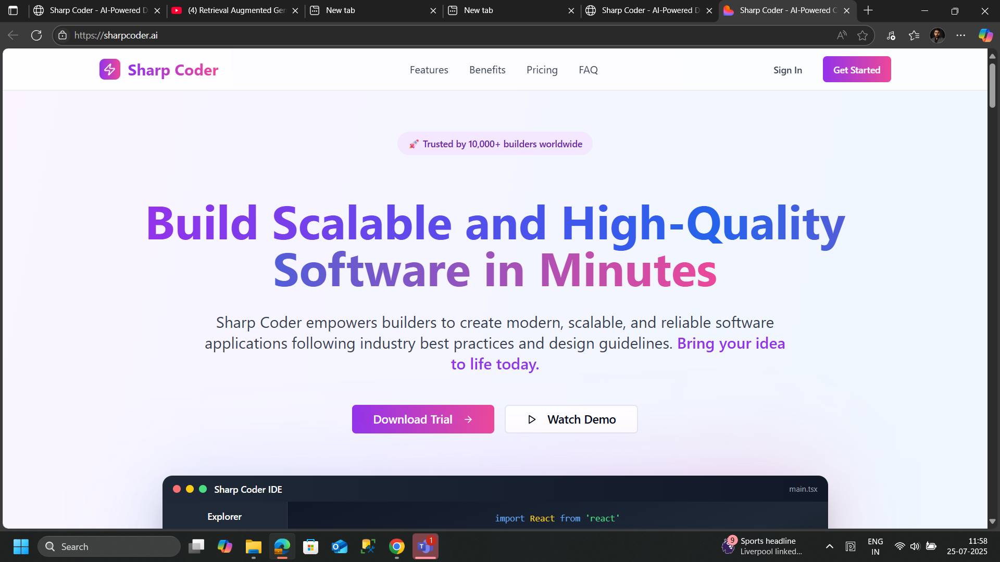

# Sharp Coder - AI-Powered Coding Platform

  
  
  
  
  
  

## 🚀 Overview

Sharp Coder is a comprehensive AI-powered coding platform that provides developers with an intuitive interface for creating, managing, and deploying web applications. Built with modern technologies, it offers a seamless development experience with AI assistance, code generation, and project management capabilities.

## ✨ Features

### 🎯 Core Features
- **AI Dashboard** - Intelligent prompt-based code generation
 - **Enhance Prompt Button** - Sends prompts to Gemini for instant refinement
- **AI Code Editor** - Full-featured editor with syntax highlighting and live preview
- **Database Management** - Multi-database support (PostgreSQL, MongoDB, Redis)
- **Project Management** - Track and organize your development projects
- **Figma Integration** - Import designs directly from Figma
- **Git Integration** - Connect and sync with GitHub repositories
- **Profile & Settings** - Comprehensive user management

### 🎨 UI/UX Features
- **Dark/Light Theme** - Toggle between themes with persistent storage
- **Responsive Design** - Works perfectly on all device sizes
- **Modern Interface** - Clean, intuitive design with smooth animations
- **Customizable Layout** - Collapsible sidebar and flexible workspace
- **Color Palette Selector** - Choose from predefined color schemes
- **Layout Templates** - Quick start with various layout options

### 🛠 Technical Features
- **TypeScript** - Full type safety and better developer experience
- **Server Components** - Optimized performance with Next.js 14
- **Component Library** - Built with shadcn/ui components
- **State Management** - Context API for theme and app state
- **File Upload** - Drag & drop screenshot support
- **Real-time Preview** - Live code preview and generation
 - **Prompt Improvement Service** - Next.js API leveraging Google Gemini for scaffolded prompt refinement

## 🏗 Tech Stack

- **Framework**: [Next.js 14](https://nextjs.org/) with App Router
- **Language**: [TypeScript](https://www.typescriptlang.org/)
- **Styling**: [Tailwind CSS](https://tailwindcss.com/)
- **UI Components**: [shadcn/ui](https://ui.shadcn.com/)
- **Icons**: [Lucide React](https://lucide.dev/)
- **State Management**: React Context API
- **Package Manager**: npm/yarn/pnpm

## 🧠 Prompt Improvement Service

Sharp Coder includes a Next.js API route that connects to Google Gemini for prompt enhancement. The service rewrites user prompts using an eight-step scaffold to clarify intent, surface context, enumerate constraints, and ensure coherent outputs. Source code lives in `lib/chatService.ts` with an accompanying route handler at `app/api/improve-prompt/route.ts`. Unit tests reside in `tests/` to validate normal usage, error conditions, and request timeouts.

## 📋 Prerequisites

Before running this project, make sure you have the following installed:

- **Node.js** (version 18.0 or higher)
- **npm** (version 9.0 or higher) or **yarn** or **pnpm**
- **Git** (for version control)

Check your versions:
\`\`\`bash
node --version
npm --version
git --version
\`\`\`

## 🚀 Quick Start

### 1. Clone the Repository

\`\`\`bash
git clone https://github.com/yourusername/sharp-coder.git
cd sharp-coder
\`\`\`

### 2. Force Install Dependencies

Choose one of the following commands based on your package manager:

#### Using npm (Recommended)
\`\`\`bash
# Force clean install
npm ci --force

# Or if you prefer regular install with force
npm install --force

# Clear npm cache if needed
npm cache clean --force
\`\`\`

#### Using Yarn
\`\`\`bash
# Force install with yarn
yarn install --force

# Or clean install
yarn install --frozen-lockfile
\`\`\`

#### Using pnpm
\`\`\`bash
# Force install with pnpm
pnpm install --force

# Or clean install
pnpm install --frozen-lockfile
\`\`\`

### 3. Set Up Environment Variables (Optional)

Create a `.env.local` file in the root directory:

\`\`\`bash
cp .env.example .env.local
\`\`\`

Add your environment variables:
\`\`\`env
# Optional: Add your API keys here
GEMINI_API_KEY=your_gemini_api_key_here
ANTHROPIC_API_KEY=your_anthropic_api_key_here
GITHUB_TOKEN=your_github_token_here
FIGMA_TOKEN=your_figma_token_here
\`\`\`

### 4. Run the Development Server

\`\`\`bash
# Using npm
npm run dev

# Using yarn
yarn dev

# Using pnpm
pnpm dev
\`\`\`

### 5. Open Your Browser

Navigate to [http://localhost:3000](http://localhost:3000) to see the application running.

## 📁 Project Structure

\`\`\`
sharp-coder/
├── app/                          # Next.js App Router
│   ├── globals.css              # Global styles
│   ├── layout.tsx               # Root layout
│   └── page.tsx                 # Main application
├── components/                   # React components
│   ├── ui/                      # shadcn/ui components
│   ├── ai-editor.tsx           # AI Code Editor
│   ├── connect-git.tsx         # Git Integration
│   ├── dashboard.tsx           # Main Dashboard
│   ├── database.tsx            # Database Management
│   ├── import-figma.tsx        # Figma Integration
│   ├── profile-settings.tsx    # User Profile
│   ├── recent-projects.tsx     # Project Management
│   ├── settings.tsx            # App Settings
│   └── sidebar.tsx             # Navigation Sidebar
├── contexts/                    # React contexts
│   └── theme-context.tsx       # Theme management
├── lib/                        # Utility functions
│   └── utils.ts               # Helper utilities
├── public/                     # Static assets
│   └── images/                # Image assets
├── package.json               # Dependencies
├── tailwind.config.ts         # Tailwind configuration
├── tsconfig.json             # TypeScript configuration
└── README.md                 # This file
\`\`\`

## 🛠 Available Scripts

\`\`\`bash
# Development
npm run dev          # Start development server
npm run build        # Build for production
npm run start        # Start production server
npm run lint         # Run ESLint
npm run type-check   # Run TypeScript checks

# Maintenance
npm run clean        # Clean build files
npm audit fix        # Fix security vulnerabilities
npm update           # Update dependencies
\`\`\`

## 🎨 Customization

### Theme Customization

The app supports both light and dark themes. You can customize colors in:
- `app/globals.css` - CSS custom properties
- `tailwind.config.ts` - Tailwind theme configuration

### Adding New Components

1. Create your component in the `components/` directory
2. Import and use shadcn/ui components from `@/components/ui`
3. Follow the existing naming conventions and structure

### Environment Configuration

Create environment-specific configurations:
- `.env.local` - Local development
- `.env.development` - Development environment
- `.env.production` - Production environment

## 🔧 Troubleshooting

### Common Issues

#### 1. Installation Issues
\`\`\`bash
# Clear all caches and reinstall
rm -rf node_modules package-lock.json
npm cache clean --force
npm install --force
\`\`\`

#### 2. TypeScript Errors
\`\`\`bash
# Check TypeScript configuration
npm run type-check

# Restart TypeScript server in VS Code
# Ctrl+Shift+P -> "TypeScript: Restart TS Server"
\`\`\`

#### 3. Build Errors
\`\`\`bash
# Clean build and rebuild
npm run clean
npm run build
\`\`\`

#### 4. Port Already in Use
\`\`\`bash
# Kill process on port 3000
npx kill-port 3000

# Or use different port
npm run dev -- -p 3001
\`\`\`

### Performance Optimization

1. **Enable SWC** (already configured in Next.js 14)
2. **Use Image Optimization** - Next.js Image component
3. **Code Splitting** - Automatic with Next.js App Router
4. **Bundle Analysis**:
   \`\`\`bash
   npm install --save-dev @next/bundle-analyzer
   npm run analyze
   \`\`\`

## 🚀 Deployment

### Vercel (Recommended)

1. Push your code to GitHub
2. Connect your repository to [Vercel](https://vercel.com)
3. Deploy automatically on every push

### Manual Deployment

\`\`\`bash
# Build the application
npm run build

# Start production server
npm run start
\`\`\`

### Docker Deployment

\`\`\`dockerfile
# Dockerfile
FROM node:18-alpine

WORKDIR /app
COPY package*.json ./
RUN npm ci --only=production
COPY . .
RUN npm run build

EXPOSE 3000
CMD ["npm", "start"]
\`\`\`

\`\`\`bash
# Build and run Docker container
docker build -t sharp-coder .
docker run -p 3000:3000 sharp-coder
\`\`\`

## 🤝 Contributing

We welcome contributions! Please follow these steps:

1. **Fork the repository**
2. **Create a feature branch**: `git checkout -b feature/amazing-feature`
3. **Commit your changes**: `git commit -m 'Add amazing feature'`
4. **Push to the branch**: `git push origin feature/amazing-feature`
5. **Open a Pull Request**

### Development Guidelines

- Follow TypeScript best practices
- Use meaningful commit messages
- Add tests for new features
- Update documentation as needed
- Follow the existing code style

## 📝 License

This project is licensed under the MIT License - see the [LICENSE](LICENSE) file for details.

## 🙏 Acknowledgments

- [Next.js](https://nextjs.org/) - The React framework for production
- [shadcn/ui](https://ui.shadcn.com/) - Beautiful and accessible components
- [Tailwind CSS](https://tailwindcss.com/) - Utility-first CSS framework
- [Lucide](https://lucide.dev/) - Beautiful & consistent icons
- [Vercel](https://vercel.com/) - Platform for frontend frameworks

## 📞 Support

If you have any questions or need help:

- 📧 Email: support@sharpcoder.dev
- 💬 Discord: [Join our community](https://discord.gg/sharpcoder)
- 🐛 Issues: [GitHub Issues](https://github.com/yourusername/sharp-coder/issues)
- 📖 Documentation: [docs.sharpcoder.dev](https://docs.sharpcoder.dev)

## 🗺 Roadmap

 - [ ] **AI Model Integration** - Gemini, Anthropic, and local models
- [ ] **Real-time Collaboration** - Multi-user editing
- [ ] **Plugin System** - Extensible architecture
- [ ] **Mobile App** - React Native companion app
- [ ] **Advanced Analytics** - Usage insights and metrics
- [ ] **Team Management** - Organization and team features
- [ ] **API Documentation** - RESTful API for integrations

---

  
Made with ❤️ by the Sharp Coder Team

  

    <a href="https://sharpcoder.dev">Website</a> •
    <a href="https://docs.sharpcoder.dev">Documentation</a> •
    <a href="https://github.com/yourusername/sharp-coder">GitHub</a>
  

